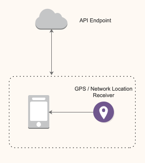

#  Motov Test Android for Interview (MTA)

       

### ● 프로젝트 개요
OpenWeatherMap의 ~~[Hourly-forecast-for-4days](https://openweathermap.org/api/hourlyVO-forecast)~~
**[Hourly-forecast-for-48hours](https://openweathermap.org/api/one-call-api)** API 를 이용하여, 현재위치의 시간별 날씨정보를 표시하는 안드로이드 앱을 구현

### ● 프로젝트 분석
Motov의 핵심 사업인 Taxi Top Media Ads Service의 로직과 유사한 설계 과제로 분석됨.

**사용자의 실시간 위치기반으로 날씨를 요청함에 따라,**

`Taxi의 실시간 위치기반으로 Ads를 요청함에 따라,`

**현재위치의 시간별 날씨를 표시하는 안드로이드 앱을 구현.**

`현재위치(지역타겟광고)의 시간별(타임스팟 광고 상품) Ads를 표시하는 클라이언트 구현.`

**Paging 기능을 사용함으로써 한 페이지에 item을 24시간 분량씩 로드하는 분할 로드 기능을 설계 기능으로 요구함.**
`Paging 기능을 사용함으로써 호출 시점에서 Ads 데이터 전체를 로드하여 표시하는 것이 아니라, 데이터 호출 시점(지역 이동 혹은 시간흐름)에 따라 해당 지역 혹은 일정시간동안 광고할 (최소필요) 데이터 갯수만 로드하여 네트워크 API 호출 cost 를 줄이거나 신규 데이터 혹은 수정된 데이터를 적절한 타이밍에 로드하며, 페이징된 데이터의 메모리 내 캐싱 혹은 로컬 데이터 관리 등, 당장 불필요한 데이터 호출을 방지하여 시스템 리소스를 효율적으로 사용하기 위한 Lazy Loading 기법.`

### ● 기술 스택

Language : 
Framework : 
Architecture : AAC ViewModel (VM + DataBinding + bindingAdapter)
VCS :  
UI : RecyeclerView, Navigation Component
비동기 처리 : 
네트워킹 :   
이미지 로더 : 
IDE :  
Package : 
Test : 
Paging : Custom Paging

## :globe_with_meridians: 시스템 구조
